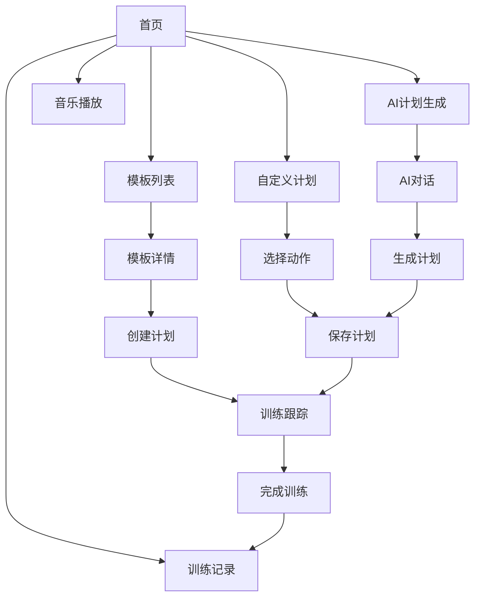

# 健身应用 - 产品需求文档

## 1. 产品概述
健身应用是一款集模板生成、自定义计划、AI生成计划和训练跟踪于一体的综合健身应用，帮助用户科学规划健身计划并记录训练进度。
- 解决用户健身计划制定困难、训练记录不系统的问题，为用户提供个性化的健身解决方案
- 目标用户为健身爱好者、初学者和专业健身人士，市场价值在于提升用户健身效果和坚持度

## 2. 核心功能

### 2.1 用户角色
| 角色 | 注册方式 | 核心权限 |
|------|----------|----------|
| 普通用户 | 微信登录/邮箱注册 | 查看模板、创建计划、跟踪训练、播放音乐 |
| 管理员 | 后台登录 | 管理运动分类、运动动作、用户管理 |

### 2.2 功能模块
1. **首页**：当前计划展示、训练记录、进度跟踪
2. **模板列表页**：预设模板展示、模板详情查看
3. **模板详情页**：模板内容展示、创建计划
4. **自定义计划页**：创建自定义计划、选择运动动作
5. **AI计划生成页**：AI对话生成计划、计划保存
6. **训练记录页**：历史训练记录、筛选查询
7. **音乐播放页**：音乐列表、播放器
8. **管理后台**：运动分类管理、运动动作管理、用户管理

### 2.3 页面详情
| 页面名称 | 模块名称 | 功能描述 |
|---------|---------|----------|
| 首页 | 当前计划 | 展示用户当前健身计划，最多3个计划，可停止/暂停，显示训练进度 |
| 首页 | 训练记录 | 展示最近3条训练记录，点击查看更多 |
| 模板列表页 | 模板展示 | 展示预设健身模板，按难度分类，支持搜索筛选 |
| 模板详情页 | 模板内容 | 展示模板的训练内容、训练日安排、运动动作 |
| 模板详情页 | 创建计划 | 从模板创建个人健身计划，设置开始日期、计划名称 |
| 自定义计划页 | 动作选择 | 选择内置运动动作，设置组数、次数、重量 |
| 自定义计划页 | 计划保存 | 保存自定义计划，可设置为模板分享 |
| AI计划生成页 | AI对话 | 与AI对话，设定健身目标，上传体检报告 |
| AI计划生成页 | 计划生成 | AI生成个性化健身计划，用户确认后保存 |
| 训练记录页 | 记录列表 | 分页展示历史训练记录，支持按时间、计划名筛选 |
| 训练记录页 | 记录详情 | 展示每条训练记录的具体动作、组数、完成情况 |
| 音乐播放页 | 音乐列表 | 展示可播放的音乐，支持上传本地音乐 |
| 音乐播放页 | 播放器 | 播放、暂停、上一首、下一首、音量调节 |
| 管理后台 | 分类管理 | 增删改查运动分类 |
| 管理后台 | 动作管理 | 增删改查运动动作，关联分类 |
| 管理后台 | 用户管理 | 查看用户列表，设置管理员权限 |

## 3. 核心流程

### 模板生成健身计划流程
用户浏览模板列表 → 选择模板查看详情 → 从模板创建计划 → 系统生成fitness_plans记录 → 用户开始训练 → 系统根据星期几展示对应训练内容 → 用户记录训练进度 → 完成训练后生成workout_schedules和workout_records记录

### 自定义计划流程
用户进入自定义计划页 → 选择运动动作 → 设置训练参数 → 保存为个人计划 → 系统生成fitness_plans和templates记录 → 用户开始训练 → 系统跟踪训练进度 → 完成训练后生成训练记录

### AI生成计划流程
用户进入AI计划生成页 → 设定健身目标 → 上传体检报告 → 与AI对话 → AI生成个性化计划 → 用户确认 → 系统保存计划 → 后续流程与自定义计划相同

## 4. 用户界面设计
### 4.1 设计风格
- 主色调：活力橙(#FF6B35)、清新蓝(#4ECDC4)
- 辅助色：活力黄(#FFD166)、激情粉(#EF476F)
- 按钮风格：圆角3D效果，渐变背景
- 字体：标题使用粗体无衬线字体，正文使用清晰易读的sans-serif字体
- 布局风格：卡片式布局，上方导航，下方内容区域
- 图标风格：简洁现代的线性图标，搭配适当的运动相关emoji

### 4.2 页面设计概览
| 页面名称 | 模块名称 | UI元素 |
|---------|---------|--------|
| 首页 | 当前计划 | 卡片式展示，进度条动画，霓虹发光效果，粒子背景 |
| 首页 | 训练记录 | 列表式展示，时间轴设计，完成状态动画 |
| 模板列表页 | 模板展示 | 网格布局，卡片悬停效果，渐变背景 |
| 模板详情页 | 模板内容 | 标签页切换，进度指示器，动画过渡效果 |
| 自定义计划页 | 动作选择 | 分类筛选，多选卡片，拖拽排序 |
| AI计划生成页 | AI对话 | 聊天界面，打字机效果，气泡动画 |
| 训练记录页 | 记录列表 | 表格布局，筛选控件，分页导航 |
| 音乐播放页 | 播放器 | 圆形播放按钮，波形动画，进度条 |

### 4.3 响应式设计
- 采用移动优先设计，适配手机、平板、桌面设备
- 断点设置：360px(手机)、768px(平板)、1200px(桌面)
- 触控优化：按钮尺寸≥44px，手势操作支持
- 内容适配：小屏幕简化布局，大屏幕增加内容密度

### 4.4 3D场景指导
- 首页可添加3D健身动作展示
- 运动动作详情页可添加3D动作演示
- 使用Three.js实现轻量化3D效果，确保性能流畅
