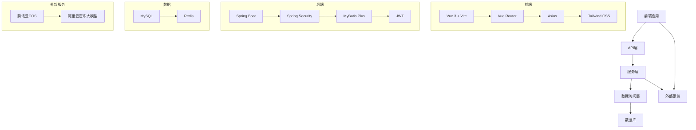
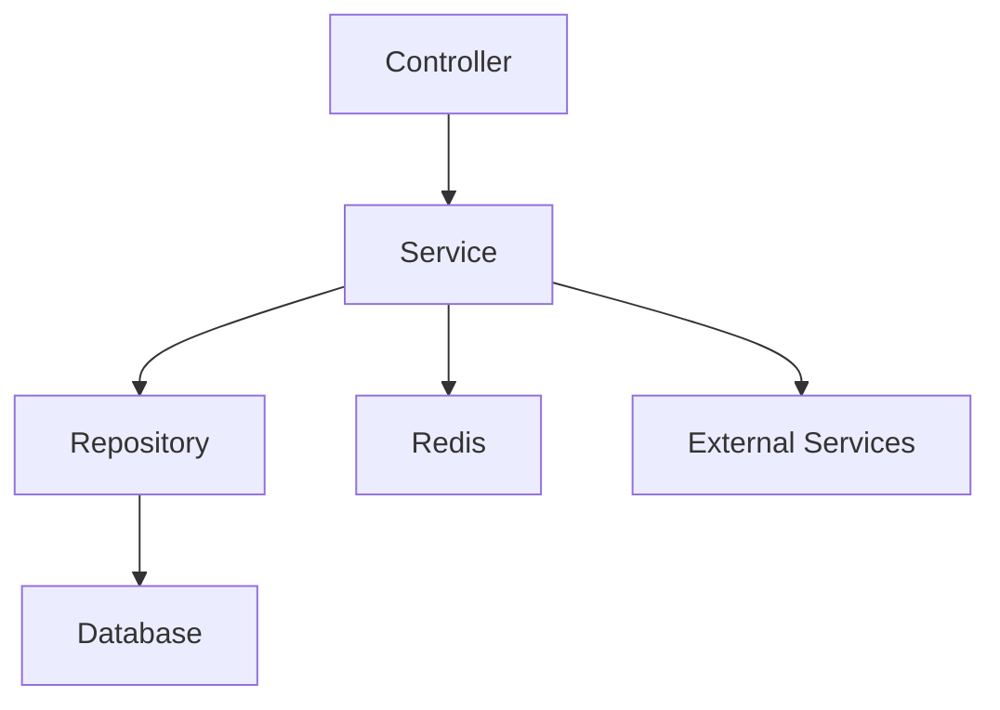
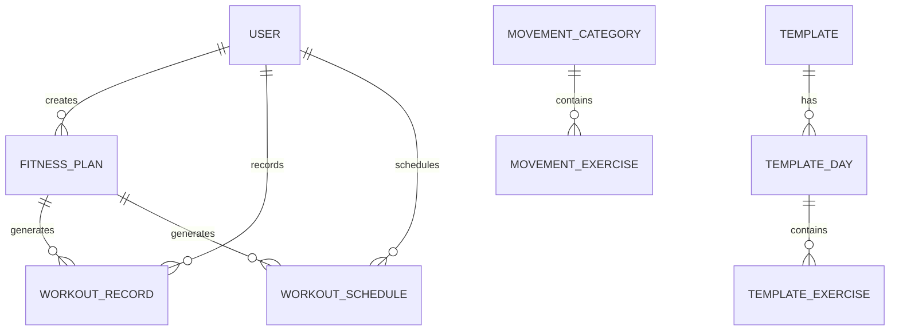

# 健身应用 - 技术架构文档

## 1. 架构设计



## 2. 技术描述
- 前端：Vue 3 + Vite + Vue Router + Axios + Tailwind CSS
- 后端：Spring Boot 3.x + Spring Security + MyBatis Plus + JWT
- 数据库：MySQL 8.0
- 缓存：Redis
- 存储：腾讯云COS
- AI服务：阿里云百炼大模型API

## 3. 路由定义

| 路由 | 目的 |
|------|------|
| / | 首页 |
| /template/list | 模板列表页 |
| /template/detail/:id | 模板详情页 |
| /custom/create | 自定义计划创建页 |
| /ai/index | AI计划生成页 |
| /records | 训练记录页 |
| /music/player | 音乐播放器 |
| /music/upload | 音乐上传页 |
| /admin/auth | 管理员登录页 |
| /admin/categories | 运动分类管理 |
| /admin/exercises | 运动动作管理 |
| /admin/users | 用户管理 |

## 4. API定义

### 4.1 认证相关
- **POST /api/auth/wechat** - 微信登录
- **POST /api/auth/admin/login** - 管理员登录
- **POST /api/auth/logout** - 登出

### 4.2 模板相关
- **GET /api/templates/list** - 获取模板列表
- **GET /api/templates/detail/{id}** - 获取模板详情
- **GET /api/templates/{id}/days** - 获取模板训练日
- **GET /api/templates/days/{id}/exercises** - 获取模板训练动作
- **POST /api/templates/create-plan** - 从模板创建计划

### 4.3 训练记录相关
- **GET /api/workout/today** - 获取今日训练
- **GET /api/workout/recent** - 获取最近训练记录
- **POST /api/workout/record** - 创建训练记录
- **PUT /api/workout/record/{id}** - 更新训练记录

### 4.4 自定义计划相关
- **GET /api/movement/categories** - 获取运动分类
- **GET /api/movement/exercises** - 获取运动动作
- **POST /api/plans/custom** - 创建自定义计划

### 4.5 AI计划相关
- **POST /api/ai/generate-plan** - AI生成计划
- **POST /api/ai/chat** - AI对话

### 4.6 音乐相关
- **POST /api/file/upload/music** - 上传音乐文件
- **POST /api/file/upload/image** - 上传图片文件
- **GET /api/file/download** - 下载文件

### 4.7 管理后台相关
- **GET /api/admin/categories** - 获取分类列表
- **POST /api/admin/categories** - 创建分类
- **PUT /api/admin/categories/{id}** - 更新分类
- **DELETE /api/admin/categories/{id}** - 删除分类
- **GET /api/admin/exercises** - 获取动作列表
- **POST /api/admin/exercises** - 创建动作
- **PUT /api/admin/exercises/{id}** - 更新动作
- **DELETE /api/admin/exercises/{id}** - 删除动作
- **GET /api/admin/users** - 获取用户列表
- **POST /api/admin/users/{id}/set-admin** - 设置管理员

## 5. 服务架构图



## 6. 数据模型

### 6.1 数据模型定义



### 6.2 数据定义语言

#### 用户表 (user)
```sql
CREATE TABLE IF NOT EXISTS user (
    id BIGINT AUTO_INCREMENT PRIMARY KEY,
    open_id VARCHAR(100),
    username VARCHAR(50) UNIQUE,
    password VARCHAR(100),
    nickname VARCHAR(50),
    avatar_url VARCHAR(255),
    gender INT,
    country VARCHAR(50),
    province VARCHAR(50),
    city VARCHAR(50),
    role VARCHAR(20) DEFAULT 'user',
    created_at TIMESTAMP DEFAULT CURRENT_TIMESTAMP,
    updated_at TIMESTAMP DEFAULT CURRENT_TIMESTAMP ON UPDATE CURRENT_TIMESTAMP
);
```

#### 运动分类表 (movement_category)
```sql
CREATE TABLE IF NOT EXISTS movement_category (
    id BIGINT AUTO_INCREMENT PRIMARY KEY,
    name VARCHAR(50) NOT NULL,
    description VARCHAR(255),
    created_at TIMESTAMP DEFAULT CURRENT_TIMESTAMP,
    updated_at TIMESTAMP DEFAULT CURRENT_TIMESTAMP ON UPDATE CURRENT_TIMESTAMP
);
```

#### 运动动作表 (movement_exercise)
```sql
CREATE TABLE IF NOT EXISTS movement_exercise (
    id BIGINT AUTO_INCREMENT PRIMARY KEY,
    category_id BIGINT,
    name VARCHAR(100) NOT NULL,
    description VARCHAR(255),
    image_url VARCHAR(255),
    video_url VARCHAR(255),
    created_at TIMESTAMP DEFAULT CURRENT_TIMESTAMP,
    updated_at TIMESTAMP DEFAULT CURRENT_TIMESTAMP ON UPDATE CURRENT_TIMESTAMP
);
```

#### 模板表 (template)
```sql
CREATE TABLE IF NOT EXISTS template (
    id BIGINT AUTO_INCREMENT PRIMARY KEY,
    name VARCHAR(100) NOT NULL,
    description VARCHAR(255),
    difficulty VARCHAR(20),
    image VARCHAR(255),
    is_public BOOLEAN DEFAULT TRUE,
    creator_id BIGINT,
    created_at TIMESTAMP DEFAULT CURRENT_TIMESTAMP,
    updated_at TIMESTAMP DEFAULT CURRENT_TIMESTAMP ON UPDATE CURRENT_TIMESTAMP
);
```

#### 模板训练日表 (template_day)
```sql
CREATE TABLE IF NOT EXISTS template_day (
    id BIGINT AUTO_INCREMENT PRIMARY KEY,
    template_id BIGINT,
    day_number INT,
    day_name VARCHAR(50),
    created_at TIMESTAMP DEFAULT CURRENT_TIMESTAMP,
    updated_at TIMESTAMP DEFAULT CURRENT_TIMESTAMP ON UPDATE CURRENT_TIMESTAMP
);
```

#### 模板训练动作表 (template_exercise)
```sql
CREATE TABLE IF NOT EXISTS template_exercise (
    id BIGINT AUTO_INCREMENT PRIMARY KEY,
    template_day_id BIGINT,
    exercise_id BIGINT,
    sets INT,
    reps INT,
    weight DECIMAL(10,2),
    rest_time INT,
    created_at TIMESTAMP DEFAULT CURRENT_TIMESTAMP,
    updated_at TIMESTAMP DEFAULT CURRENT_TIMESTAMP ON UPDATE CURRENT_TIMESTAMP
);
```

#### 健身计划表 (fitness_plan)
```sql
CREATE TABLE IF NOT EXISTS fitness_plan (
    id BIGINT AUTO_INCREMENT PRIMARY KEY,
    user_id BIGINT,
    template_id BIGINT,
    name VARCHAR(100) NOT NULL,
    description VARCHAR(255),
    start_date DATE,
    end_date DATE,
    current_day INT DEFAULT 1,
    total_days INT,
    status VARCHAR(20) DEFAULT 'active',
    created_at TIMESTAMP DEFAULT CURRENT_TIMESTAMP,
    updated_at TIMESTAMP DEFAULT CURRENT_TIMESTAMP ON UPDATE CURRENT_TIMESTAMP
);
```

#### 训练记录表 (workout_record)
```sql
CREATE TABLE IF NOT EXISTS workout_record (
    id BIGINT AUTO_INCREMENT PRIMARY KEY,
    user_id BIGINT,
    plan_id BIGINT,
    date DATE NOT NULL,
    day_number INT,
    completed BOOLEAN DEFAULT FALSE,
    exercises_json TEXT,
    created_at TIMESTAMP DEFAULT CURRENT_TIMESTAMP,
    updated_at TIMESTAMP DEFAULT CURRENT_TIMESTAMP ON UPDATE CURRENT_TIMESTAMP
);
```

#### 训练日程表 (workout_schedule)
```sql
CREATE TABLE IF NOT EXISTS workout_schedule (
    id BIGINT AUTO_INCREMENT PRIMARY KEY,
    user_id BIGINT,
    plan_id BIGINT,
    date DATE NOT NULL,
    status VARCHAR(20) DEFAULT 'scheduled',
    created_at TIMESTAMP DEFAULT CURRENT_TIMESTAMP,
    updated_at TIMESTAMP DEFAULT CURRENT_TIMESTAMP ON UPDATE CURRENT_TIMESTAMP,
    UNIQUE KEY unique_user_date (user_id, date)
);
```
