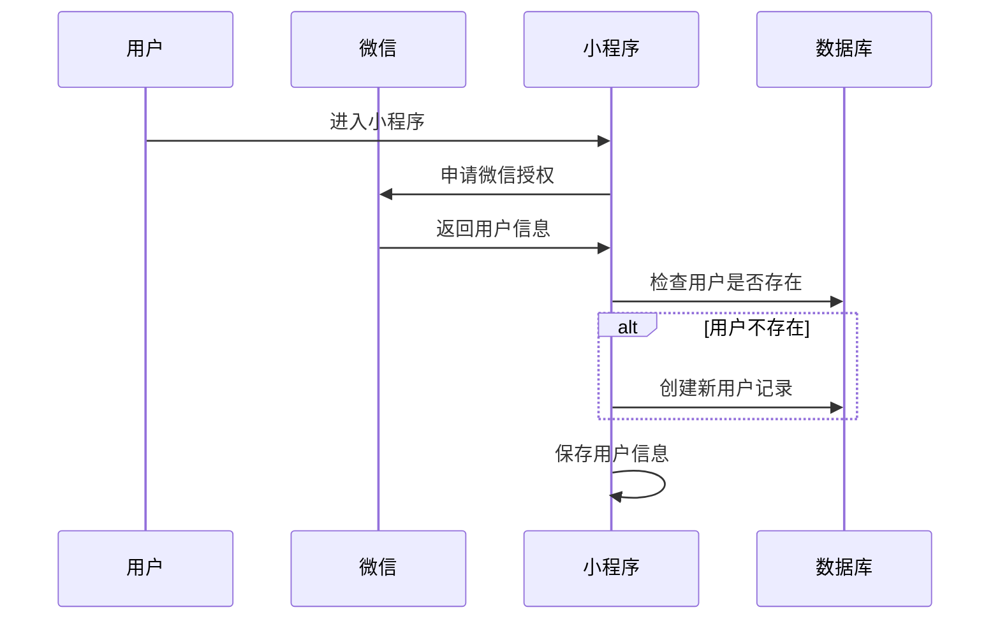
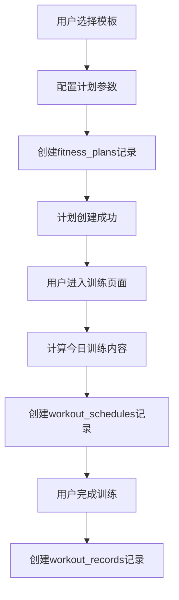
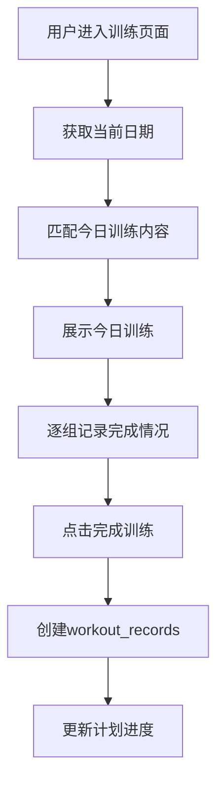

# 健身小程序产品需求文档

## 1. Product Overview

健身小程序是一款集模板生成、自定义计划、AI生成计划和训练跟踪于一体的综合健身应用。

- 为用户提供便捷的健身计划管理和训练跟踪功能
- 目标用户为健身爱好者和希望开始健身的人群
- 市场价值在于降低健身门槛，提供个性化的健身解决方案

## 2. Core Features

### 2.1 User Roles

| Role | Registration Method | Core Permissions |
|------|---------------------|------------------|
| 普通用户 | 微信登录 | 使用所有用户端功能，管理个人计划和训练记录 |
| 管理员 | 账号密码登录 | 除用户端功能 + 管理运动分类和运动动作数据 |
| 超级管理员 | 账号密码登录 | 除管理员功能 + 设置普通管理员 |

### 2.2 Feature Module

1. **首页**：展示当前计划、进度、训练记录
2. **用户登录/注册**：获取并保存微信用户信息
3. **模板生成健身计划**：从预设模板创建健身计划
4. **自定义健身计划**：用户自定义创建健身计划
5. **AI生成健身计划**：通过AI对话生成个性化计划
6. **训练跟踪**：记录每日训练进度
7. **音乐播放**：训练时播放背景音乐
8. **管理端**：管理运动分类和动作数据
9. **管理员登录**：管理员账号密码登录
10. **用户管理**：超级管理员设置普通管理员

### 2.3 Page Details

| Page Name | Module Name | Feature description |
|-----------|-------------|---------------------|
| 首页 | 当前计划展示 | 展示最多3个活跃计划，最近运动的排在最前面，显示进度 |
| 首页 | 训练记录 | 展示最近3条训练记录，支持分页查看更多 |
| 用户登录 | 微信授权 | 获取微信openId、昵称、头像等信息 |
| 模板列表 | 模板展示 | 展示官方模板和用户分享的模板 |
| 模板详情 | 模板内容展示 | 展示模板的训练内容 |
| 自定义计划创建 | 运动分类选择 | 按分类浏览运动动作 |
| 自定义计划创建 | 动作选择与配置 | 选择动作、配置组数、次数 |
| AI计划生成 | AI对话界面 | 用户设定目标，上传体检报告，与AI对话 |
| 训练跟踪 | 今日训练展示 | 根据当前日期匹配训练内容 |
| 训练跟踪 | 组数记录 | 一组一组记录完成情况 |
| 音乐播放器 | 音乐选择与播放 | 选择并播放背景音乐 |
| 管理员登录 | 账号密码登录 | 输入管理员用户名和密码登录 |
| 管理端 | 运动分类管理 | 增删改查运动分类 |
| 管理端 | 运动动作管理 | 增删改查运动动作 |
| 管理端 | 用户管理 | 超级管理员查看用户列表，设置普通管理员 |

## 3. Core Process

### 3.1 用户登录流程

### 3.2 模板生成计划流程

### 3.3 训练跟踪流程

## 4. User Interface Design

### 4.1 Design Style
- Primary colors: 主色使用活力橙 (#FF6B35)，辅助色使用清新蓝 (#4ECDC4)
- Button style: 圆角矩形，带轻微阴影，悬停时放大效果
- Font and sizes: 主要使用无衬线字体，标题18-24px，正文14-16px
- Layout style: 卡片式布局，圆角设计
- Icon/emoji style: 扁平化图标，使用emoji增加趣味性

### 4.2 Page Design Overview

| Page Name | Module Name | UI Elements |
|-----------|-------------|-------------|
| 首页 | 当前计划 | 卡片式展示，进度条动画，最近计划置顶 |
| 首页 | 训练记录 | 时间线布局，展示计划名、动作、时间、组数 |
| 模板列表 | 模板卡片 | 图片、名称、描述、难度标签 |
| 训练跟踪 | 训练界面 | 动作名称、组数、进度条、完成按钮 |
| 音乐播放器 | 播放器 | 浮动播放器，可折叠/展开 |

### 4.3 Responsiveness
- 移动端优先设计，适配微信小程序环境
- 触摸优化：按钮尺寸适合手指点击
- 响应式布局：自适应不同屏幕尺寸

