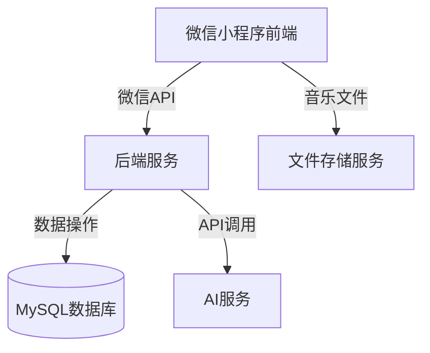
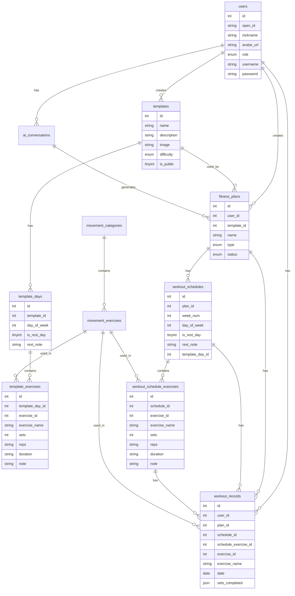
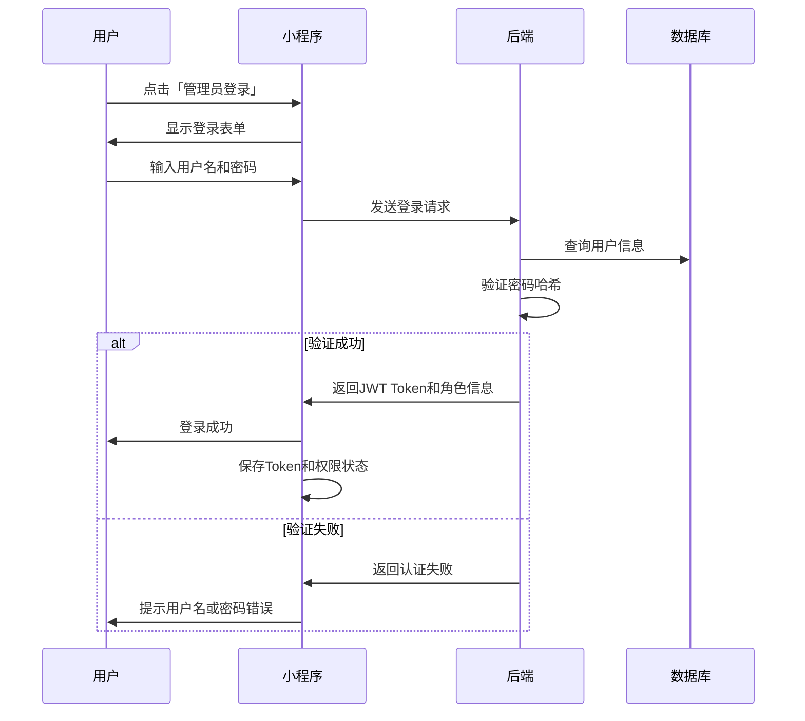
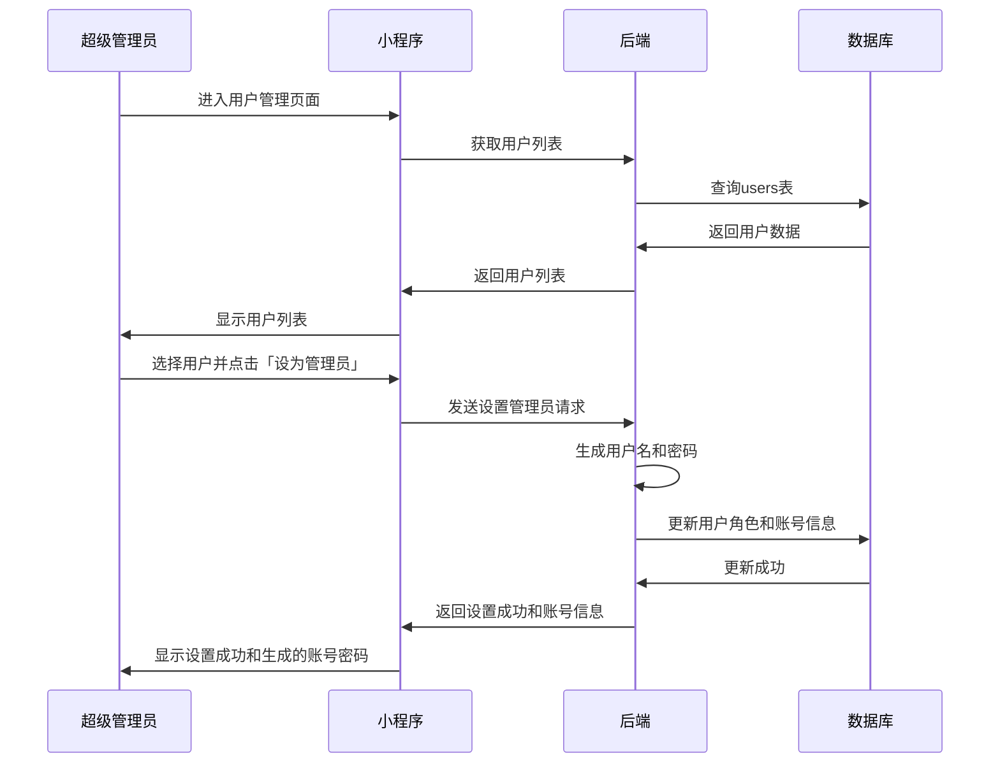

# 健身小程序技术架构文档

## 1. Architecture Design



## 2. Technology Description

- 前端: uni-app + Vue 3 + Vite
- 后端: Spring Boot 3.x + MyBatis Plus 3.5+
- 数据库: MySQL 8.0
- AI服务: 阿里百炼大模型API
- 存储: 腾讯云COS
- 认证: JWT + Spring Security
- 缓存: Redis

### 2.1 前端打包配置

**实现原理：**
- 使用 uni-app 框架开发，支持多端打包
- 通过 `npm run dev:mp-weixin` 命令生成微信小程序项目
- 生成的项目可直接在微信开发者工具中打开

**打包过程：**
1. 安装依赖：`npm install`
2. 开发模式：`npm run dev:mp-weixin`
3. 构建生产版本：`npm run build:mp-weixin`
4. 生成的代码位于 `dist/dev/mp-weixin` 或 `dist/build/mp-weixin` 目录
5. 在微信开发者工具中导入该目录即可

### 2.2 后端配置

**Spring Boot 3 配置：**
- Java 17+
- Spring Boot 3.2.x
- MyBatis Plus 3.5.5+
- Spring Security 6.0+
- JWT 4.0+
- Redis 依赖

**阿里百炼 AI 服务配置：**
```yaml
# application.yml
alibaba:
  bailing:
    api-key: "your-api-key"
    api-secret: "your-api-secret"
    endpoint: "https://ark.cn-beijing.volces.com/api/v3"
    model: "ep-20240415123456-7890"
```

**腾讯云COS 配置：**
```yaml
# application.yml
tencent:
  cos:
    secret-id: "your-secret-id"
    secret-key: "your-secret-key"
    bucket: "fitness-app-1234567890"
    region: "ap-guangzhou"
    base-url: "https://fitness-app-1234567890.cos.ap-guangzhou.myqcloud.com"
```

## 3. Route Definitions (小程序页面路由)

| Route | Purpose |
|-------|---------|
| /pages/home/index | 首页 - 当前计划和训练记录 |
| /pages/login/index | 微信登录页 |
| /pages/template/list | 模板列表页 |
| /pages/template/detail | 模板详情页 |
| /pages/custom/create | 自定义计划创建页 |
| /pages/ai/generate | AI生成计划页 |
| /pages/workout/track | 训练跟踪页 |
| /pages/music/player | 音乐播放器 |
| /pages/admin/auth | 管理员认证页 |
| /pages/admin/categories | 运动分类管理 |
| /pages/admin/exercises | 运动动作管理 |

## 4. API Definitions

### 4.1 用户相关API

```typescript
// 获取微信用户信息
interface WechatLoginRequest {
  code: string;
}

interface WechatLoginResponse {
  open_id: string;
  nickname: string;
  avatar_url: string;
  token: string;
  role: 'user' | 'admin' | 'super_admin';
}

// 管理员登录
interface AdminLoginRequest {
  username: string;
  password: string;
}

interface AdminLoginResponse {
  success: boolean;
  token?: string;
  role?: 'admin' | 'super_admin';
  message: string;
}

// 超级管理员设置普通管理员
interface SetAdminRequest {
  user_id: number;
}

interface SetAdminResponse {
  success: boolean;
  username: string;
  password: string;
  message: string;
}
```

### 4.2 模板相关API

```typescript
// 获取模板列表
interface GetTemplatesResponse {
  templates: Array<{
    id: number;
    name: string;
    description: string;
    image: string;
    difficulty: 'beginner' | 'intermediate' | 'advanced';
    is_public: boolean;
  }>;
}

// 创建计划
interface CreatePlanRequest {
  template_id?: number;
  name: string;
  type: 'template' | 'custom' | 'ai';
  goal: string;
  difficulty: 'beginner' | 'intermediate' | 'advanced';
  duration_weeks: number;
  start_date: string;
  exercises?: any[];
}

interface CreatePlanResponse {
  plan_id: number;
  success: boolean;
}
```

### 4.3 训练相关API

```typescript
// 获取今日训练
interface GetTodayWorkoutResponse {
  plan_id: number;
  plan_name: string;
  day_of_week: number;
  exercises: Array<{
    id: number;
    name: string;
    sets: number;
    reps?: string;
    duration?: string;
    note?: string;
    is_rest_day?: boolean;
  }>;
}

// 记录训练
interface RecordWorkoutRequest {
  plan_id: number;
  date: string;
  exercises: Array<{
    exercise_id?: number;
    exercise_name?: string;
    sets_completed: number[];
    weight?: number;
    duration?: number;
  }>;
}

interface RecordWorkoutResponse {
  record_ids: number[];
  success: boolean;
}
```

### 4.4 AI相关API

```typescript
// AI生成计划
interface AIGeneratePlanRequest {
  goal: string;
  fitness_level: string;
  duration_weeks: number;
  medical_report?: string;
}

interface AIGeneratePlanResponse {
  conversation_id: number;
  messages: any[];
}

// AI对话
interface AIChatRequest {
  conversation_id: number;
  message: string;
}

interface AIChatResponse {
  reply: string;
  plan_data?: any;
}
```

## 5. 数据模型

### 5.1 数据模型ER图



### 5.2 数据定义语言 (DDL)

```sql
-- 用户表
CREATE TABLE users (
  id INT PRIMARY KEY AUTO_INCREMENT COMMENT '用户ID',
  open_id VARCHAR(64) UNIQUE COMMENT '微信openID',
  nickname VARCHAR(100) COMMENT '昵称',
  avatar_url VARCHAR(500) COMMENT '头像URL',
  gender TINYINT COMMENT '性别 1男2女',
  country VARCHAR(50) COMMENT '国家',
  province VARCHAR(50) COMMENT '省份',
  city VARCHAR(50) COMMENT '城市',
  role ENUM('user','admin','super_admin') DEFAULT 'user' COMMENT '用户角色',
  username VARCHAR(50) UNIQUE COMMENT '管理员用户名',
  password VARCHAR(100) COMMENT '管理员密码（加密存储）',
  fitness_goals JSON COMMENT '健身目标 JSON数组',
  fitness_level ENUM('beginner','intermediate','advanced') DEFAULT 'beginner',
  height DECIMAL(5,1) COMMENT '身高(cm)',
  weight DECIMAL(5,1) COMMENT '体重(kg)',
  is_deleted TINYINT DEFAULT 0 COMMENT '逻辑删除 0否 1是',
  created_at TIMESTAMP DEFAULT CURRENT_TIMESTAMP,
  updated_at TIMESTAMP DEFAULT CURRENT_TIMESTAMP ON UPDATE CURRENT_TIMESTAMP,
  INDEX idx_open_id (open_id),
  INDEX idx_username (username),
  INDEX idx_role (role),
  INDEX idx_is_deleted (is_deleted)
) ENGINE=InnoDB DEFAULT CHARSET=utf8mb4 COMMENT='用户表';

-- 运动分类表
CREATE TABLE movement_categories (
  id INT PRIMARY KEY AUTO_INCREMENT COMMENT '分类ID',
  category_name VARCHAR(50) NOT NULL COMMENT '分类名称',
  description TEXT COMMENT '分类描述',
  icon VARCHAR(100) COMMENT '图标标识',
  sort_order INT DEFAULT 0 COMMENT '排序',
  parent_id INT DEFAULT 0 COMMENT '父级ID 0表示顶级分类',
  is_active TINYINT DEFAULT 1 COMMENT '是否启用',
  created_at TIMESTAMP DEFAULT CURRENT_TIMESTAMP,
  updated_at TIMESTAMP DEFAULT CURRENT_TIMESTAMP ON UPDATE CURRENT_TIMESTAMP,
  is_deleted TINYINT DEFAULT 0 COMMENT '逻辑删除 0否 1是',
  INDEX idx_parent_id (parent_id),
  INDEX idx_sort_order (sort_order),
  INDEX idx_is_deleted (is_deleted)
) ENGINE=InnoDB DEFAULT CHARSET=utf8mb4 COMMENT='运动分类表';

-- 运动动作表
CREATE TABLE movement_exercises (
  id INT PRIMARY KEY AUTO_INCREMENT COMMENT '动作ID',
  exercise_name VARCHAR(100) NOT NULL COMMENT '动作名称',
  en_name VARCHAR(100) COMMENT '英文名称',
  category_id INT NOT NULL COMMENT '所属分类ID',
  difficulty_level ENUM('beginner','intermediate','advanced') DEFAULT 'beginner',
  target_muscle VARCHAR(200) COMMENT '目标肌肉群',
  equipment_needed VARCHAR(200) COMMENT '所需器材',
  description TEXT COMMENT '动作描述',
  video_url VARCHAR(500) COMMENT '教学视频链接',
  image_url VARCHAR(500) COMMENT '示意图链接',
  calories_per_hour DECIMAL(6,2) COMMENT '每小时消耗卡路里',
  is_popular TINYINT DEFAULT 0 COMMENT '是否热门',
  is_bodyweight TINYINT DEFAULT 0 COMMENT '是否自重训练',
  created_at TIMESTAMP DEFAULT CURRENT_TIMESTAMP,
  updated_at TIMESTAMP DEFAULT CURRENT_TIMESTAMP ON UPDATE CURRENT_TIMESTAMP,
  is_deleted TINYINT DEFAULT 0 COMMENT '逻辑删除 0否 1是',
  FOREIGN KEY (category_id) REFERENCES movement_categories(id) ON DELETE CASCADE,
  INDEX idx_category_id (category_id),
  INDEX idx_difficulty (difficulty_level),
  INDEX idx_popular (is_popular),
  INDEX idx_is_deleted (is_deleted)
) ENGINE=InnoDB DEFAULT CHARSET=utf8mb4 COMMENT='运动动作表';

-- 健身模板表
CREATE TABLE templates (
  id INT PRIMARY KEY AUTO_INCREMENT COMMENT '模板ID',
  name VARCHAR(100) NOT NULL COMMENT '模板名称',
  description TEXT NOT NULL COMMENT '模板描述',
  image VARCHAR(500) COMMENT '模板图片',
  difficulty ENUM('beginner','intermediate','advanced') DEFAULT 'beginner',
  is_public TINYINT DEFAULT 1 COMMENT '是否公开模板',
  created_by INT COMMENT '创建者用户ID',
  created_at TIMESTAMP DEFAULT CURRENT_TIMESTAMP,
  updated_at TIMESTAMP DEFAULT CURRENT_TIMESTAMP ON UPDATE CURRENT_TIMESTAMP,
  is_deleted TINYINT DEFAULT 0 COMMENT '逻辑删除 0否 1是',
  FOREIGN KEY (created_by) REFERENCES users(id) ON DELETE SET NULL,
  INDEX idx_created_by (created_by),
  INDEX idx_is_public (is_public),
  INDEX idx_is_deleted (is_deleted)
) ENGINE=InnoDB DEFAULT CHARSET=utf8mb4 COMMENT='健身模板表';

-- 模板训练日表
CREATE TABLE template_days (
  id INT PRIMARY KEY AUTO_INCREMENT COMMENT '训练日ID',
  template_id INT NOT NULL COMMENT '模板ID',
  day_of_week INT NOT NULL COMMENT '周几 1-7',
  is_rest_day TINYINT DEFAULT 0 COMMENT '是否休息日',
  rest_note VARCHAR(200) COMMENT '休息日备注',
  estimated_duration INT COMMENT '预计时长(分钟)',
  created_at TIMESTAMP DEFAULT CURRENT_TIMESTAMP,
  updated_at TIMESTAMP DEFAULT CURRENT_TIMESTAMP ON UPDATE CURRENT_TIMESTAMP,
  is_deleted TINYINT DEFAULT 0 COMMENT '逻辑删除 0否 1是',
  FOREIGN KEY (template_id) REFERENCES templates(id) ON DELETE CASCADE,
  INDEX idx_template_id (template_id),
  INDEX idx_template_day (template_id, day_of_week),
  INDEX idx_is_deleted (is_deleted)
) ENGINE=InnoDB DEFAULT CHARSET=utf8mb4 COMMENT='模板训练日表';

-- 模板动作关联表
CREATE TABLE template_exercises (
  id INT PRIMARY KEY AUTO_INCREMENT COMMENT '关联ID',
  template_day_id INT NOT NULL COMMENT '模板训练日ID',
  exercise_id INT COMMENT '动作ID',
  exercise_name VARCHAR(100) COMMENT '动作名称（当没有关联动作时使用）',
  sets INT NOT NULL COMMENT '组数',
  reps VARCHAR(20) COMMENT '每组次数',
  duration VARCHAR(20) COMMENT '持续时间',
  note VARCHAR(200) COMMENT '备注',
  sort_order INT DEFAULT 0 COMMENT '排序',
  created_at TIMESTAMP DEFAULT CURRENT_TIMESTAMP,
  updated_at TIMESTAMP DEFAULT CURRENT_TIMESTAMP ON UPDATE CURRENT_TIMESTAMP,
  is_deleted TINYINT DEFAULT 0 COMMENT '逻辑删除 0否 1是',
  FOREIGN KEY (template_day_id) REFERENCES template_days(id) ON DELETE CASCADE,
  FOREIGN KEY (exercise_id) REFERENCES movement_exercises(id) ON DELETE SET NULL,
  INDEX idx_template_day_id (template_day_id),
  INDEX idx_exercise_id (exercise_id),
  INDEX idx_is_deleted (is_deleted)
) ENGINE=InnoDB DEFAULT CHARSET=utf8mb4 COMMENT='模板动作关联表';

-- 健身计划表
CREATE TABLE fitness_plans (
  id INT PRIMARY KEY AUTO_INCREMENT COMMENT '计划ID',
  user_id INT NOT NULL COMMENT '用户ID',
  template_id INT COMMENT '模板ID',
  name VARCHAR(100) NOT NULL COMMENT '计划名称',
  type ENUM('template','custom','ai') NOT NULL COMMENT '计划类型',
  goal VARCHAR(50) NOT NULL COMMENT '健身目标',
  difficulty ENUM('beginner','intermediate','advanced') DEFAULT 'beginner',
  duration_weeks INT NOT NULL COMMENT '周期(周)',
  start_date DATE NOT NULL COMMENT '开始日期',
  end_date DATE NOT NULL COMMENT '结束日期',
  status ENUM('active','paused','completed','stopped') DEFAULT 'active',
  is_shared TINYINT DEFAULT 0 COMMENT '是否分享',
  shared_code VARCHAR(32) COMMENT '分享码',
  last_workout_date DATE COMMENT '最后训练日期',
  created_at TIMESTAMP DEFAULT CURRENT_TIMESTAMP,
  updated_at TIMESTAMP DEFAULT CURRENT_TIMESTAMP ON UPDATE CURRENT_TIMESTAMP,
  is_deleted TINYINT DEFAULT 0 COMMENT '逻辑删除 0否 1是',
  FOREIGN KEY (user_id) REFERENCES users(id) ON DELETE CASCADE,
  FOREIGN KEY (template_id) REFERENCES templates(id) ON DELETE SET NULL,
  INDEX idx_user_id (user_id),
  INDEX idx_status (status),
  INDEX idx_shared_code (shared_code),
  INDEX idx_user_status (user_id, status),
  INDEX idx_is_deleted (is_deleted)
) ENGINE=InnoDB DEFAULT CHARSET=utf8mb4 COMMENT='健身计划表';

-- 训练日程表
CREATE TABLE workout_schedules (
  id INT PRIMARY KEY AUTO_INCREMENT COMMENT '日程ID',
  plan_id INT NOT NULL COMMENT '计划ID',
  week_num INT NOT NULL COMMENT '第几周',
  day_of_week INT NOT NULL COMMENT '周几 1-7',
  is_rest_day TINYINT DEFAULT 0 COMMENT '是否休息日',
  rest_note VARCHAR(200) COMMENT '休息日备注',
  estimated_duration INT COMMENT '预计时长(分钟)',
  template_day_id INT COMMENT '关联的模板训练日ID',
  created_at TIMESTAMP DEFAULT CURRENT_TIMESTAMP,
  updated_at TIMESTAMP DEFAULT CURRENT_TIMESTAMP ON UPDATE CURRENT_TIMESTAMP,
  is_deleted TINYINT DEFAULT 0 COMMENT '逻辑删除 0否 1是',
  FOREIGN KEY (plan_id) REFERENCES fitness_plans(id) ON DELETE CASCADE,
  FOREIGN KEY (template_day_id) REFERENCES template_days(id) ON DELETE SET NULL,
  INDEX idx_plan_id (plan_id),
  INDEX idx_plan_week (plan_id, week_num),
  INDEX idx_plan_day (plan_id, day_of_week),
  INDEX idx_is_deleted (is_deleted)
) ENGINE=InnoDB DEFAULT CHARSET=utf8mb4 COMMENT='训练日程表';

-- 训练日程动作表
CREATE TABLE workout_schedule_exercises (
  id INT PRIMARY KEY AUTO_INCREMENT COMMENT '训练动作ID',
  schedule_id INT NOT NULL COMMENT '日程ID',
  exercise_id INT COMMENT '动作ID',
  exercise_name VARCHAR(100) COMMENT '动作名称（当没有关联动作时使用）',
  sets INT NOT NULL COMMENT '组数',
  reps VARCHAR(20) COMMENT '每组次数',
  duration VARCHAR(20) COMMENT '持续时间',
  note VARCHAR(200) COMMENT '备注',
  sort_order INT DEFAULT 0 COMMENT '排序',
  created_at TIMESTAMP DEFAULT CURRENT_TIMESTAMP,
  updated_at TIMESTAMP DEFAULT CURRENT_TIMESTAMP ON UPDATE CURRENT_TIMESTAMP,
  is_deleted TINYINT DEFAULT 0 COMMENT '逻辑删除 0否 1是',
  FOREIGN KEY (schedule_id) REFERENCES workout_schedules(id) ON DELETE CASCADE,
  FOREIGN KEY (exercise_id) REFERENCES movement_exercises(id) ON DELETE SET NULL,
  INDEX idx_schedule_id (schedule_id),
  INDEX idx_exercise_id (exercise_id),
  INDEX idx_is_deleted (is_deleted)
) ENGINE=InnoDB DEFAULT CHARSET=utf8mb4 COMMENT='训练日程动作表';

-- 锻炼记录表
CREATE TABLE workout_records (
  id INT PRIMARY KEY AUTO_INCREMENT COMMENT '记录ID',
  user_id INT NOT NULL COMMENT '用户ID',
  plan_id INT NOT NULL COMMENT '计划ID',
  schedule_id INT COMMENT '日程ID',
  schedule_exercise_id INT COMMENT '训练日程动作ID',
  exercise_id INT COMMENT '动作ID',
  exercise_name VARCHAR(100) COMMENT '动作名称',
  date DATE NOT NULL COMMENT '训练日期',
  sets_completed JSON NOT NULL COMMENT '完成组数 JSON',
  weight DECIMAL(5,1) COMMENT '重量(kg)',
  duration INT COMMENT '时长(秒)',
  notes TEXT COMMENT '备注',
  created_at TIMESTAMP DEFAULT CURRENT_TIMESTAMP,
  updated_at TIMESTAMP DEFAULT CURRENT_TIMESTAMP ON UPDATE CURRENT_TIMESTAMP,
  is_deleted TINYINT DEFAULT 0 COMMENT '逻辑删除 0否 1是',
  FOREIGN KEY (user_id) REFERENCES users(id) ON DELETE CASCADE,
  FOREIGN KEY (plan_id) REFERENCES fitness_plans(id) ON DELETE CASCADE,
  FOREIGN KEY (schedule_id) REFERENCES workout_schedules(id) ON DELETE SET NULL,
  FOREIGN KEY (schedule_exercise_id) REFERENCES workout_schedule_exercises(id) ON DELETE SET NULL,
  FOREIGN KEY (exercise_id) REFERENCES movement_exercises(id) ON DELETE SET NULL,
  INDEX idx_user_id (user_id),
  INDEX idx_plan_id (plan_id),
  INDEX idx_schedule_id (schedule_id),
  INDEX idx_exercise_id (exercise_id),
  INDEX idx_date (date),
  INDEX idx_user_date (user_id, date),
  INDEX idx_is_deleted (is_deleted)
) ENGINE=InnoDB DEFAULT CHARSET=utf8mb4 COMMENT='锻炼记录表';

-- AI对话历史表
CREATE TABLE ai_conversations (
  id INT PRIMARY KEY AUTO_INCREMENT COMMENT '对话ID',
  user_id INT NOT NULL COMMENT '用户ID',
  messages JSON NOT NULL COMMENT '对话历史 JSON',
  plan_id INT COMMENT '生成的计划ID',
  status ENUM('in_progress','completed','cancelled') DEFAULT 'in_progress',
  created_at TIMESTAMP DEFAULT CURRENT_TIMESTAMP,
  updated_at TIMESTAMP DEFAULT CURRENT_TIMESTAMP ON UPDATE CURRENT_TIMESTAMP,
  is_deleted TINYINT DEFAULT 0 COMMENT '逻辑删除 0否 1是',
  FOREIGN KEY (user_id) REFERENCES users(id) ON DELETE CASCADE,
  FOREIGN KEY (plan_id) REFERENCES fitness_plans(id) ON DELETE SET NULL,
  INDEX idx_user_id (user_id),
  INDEX idx_status (status),
  INDEX idx_is_deleted (is_deleted)
) ENGINE=InnoDB DEFAULT CHARSET=utf8mb4 COMMENT='AI对话历史表';

-- 音乐表
CREATE TABLE music_tracks (
  id INT PRIMARY KEY AUTO_INCREMENT COMMENT '音乐ID',
  name VARCHAR(100) NOT NULL COMMENT '音乐名称',
  artist VARCHAR(100) COMMENT '艺术家',
  album VARCHAR(100) COMMENT '专辑',
  duration INT COMMENT '时长(秒)',
  file_url VARCHAR(500) NOT NULL COMMENT '文件URL',
  cover_url VARCHAR(500) COMMENT '封面URL',
  genre VARCHAR(50) COMMENT '音乐流派',
  bpm INT COMMENT '节奏BPM',
  is_active TINYINT DEFAULT 1 COMMENT '是否启用',
  created_at TIMESTAMP DEFAULT CURRENT_TIMESTAMP,
  updated_at TIMESTAMP DEFAULT CURRENT_TIMESTAMP ON UPDATE CURRENT_TIMESTAMP,
  is_deleted TINYINT DEFAULT 0 COMMENT '逻辑删除 0否 1是',
  INDEX idx_is_deleted (is_deleted)
) ENGINE=InnoDB DEFAULT CHARSET=utf8mb4 COMMENT='音乐表';
```

## 6. 初始数据准备

### 6.1 运动分类初始数据

```sql
-- 插入运动分类数据
INSERT INTO movement_categories (category_name, description, icon, parent_id, sort_order) VALUES
-- 顶级分类
('力量训练', '通过抗阻训练增强肌肉力量和耐力', 'dumbbell', 0, 1),
('有氧运动', '提高心肺功能和燃烧脂肪的运动', 'heart', 0, 2),
('柔韧性训练', '提高关节活动度和肌肉伸展性', 'flexibility', 0, 3),
('功能性训练', '模拟日常生活动作的训练', 'function', 0, 4),

-- 力量训练的子分类
('胸部训练', '胸大肌、胸小肌等相关训练', 'chest', 1, 1),
('背部训练', '背阔肌、斜方肌等相关训练', 'back', 1, 2),
('腿部训练', '股四头肌、腘绳肌等相关训练', 'leg', 1, 3),
('肩部训练', '三角肌等相关训练', 'shoulder', 1, 4),
('手臂训练', '肱二头肌、肱三头肌训练', 'arm', 1, 5),
('核心训练', '腹肌、腰腹核心训练', 'core', 1, 6),

-- 有氧运动的子分类
('跑步类', '各种跑步和跑步机训练', 'run', 2, 1),
('骑行类', '自行车、动感单车等', 'bike', 2, 2),
('游泳类', '各种游泳姿势', 'swim', 2, 3),
('跳绳类', '各类跳绳运动', 'rope', 2, 4),

-- 柔韧性训练的子分类
('拉伸运动', '静态和动态拉伸', 'stretch', 3, 1),
('瑜伽', '各种瑜伽体式', 'yoga', 3, 2),
('普拉提', '普拉提核心训练', 'pilates', 3, 3),

-- 功能性训练的子分类
('爆发力训练', '提高瞬间爆发力', 'power', 4, 1),
('平衡训练', '提高身体平衡能力', 'balance', 4, 2),
('敏捷训练', '提高身体敏捷性', 'agility', 4, 3);
```

### 6.2 运动动作初始数据

```sql
-- 插入超级管理员初始数据
INSERT INTO users (role, username, password, nickname) VALUES
('super_admin', 'admin', '$2a$10$eW75xU2uLr0yq9X1e0e7pu5h0Q5qY0X7e0e7pu5h0Q5qY0X7e0e7pu', '超级管理员');

-- 插入运动动作示例数据
INSERT INTO movement_exercises (exercise_name, en_name, category_id, difficulty_level, target_muscle, equipment_needed, description, calories_per_hour, is_popular, is_bodyweight) VALUES
-- 胸部训练动作
('俯卧撑', 'Push-up', 5, 'beginner', '胸大肌、三角肌前束、肱三头肌', '瑜伽垫(可选)', '经典的胸部自重训练动作，锻炼胸肌和手臂力量', 300.00, 1, 1),
('杠铃卧推', 'Barbell Bench Press', 5, 'intermediate', '胸大肌、三角肌前束、肱三头肌', '卧推凳、杠铃、杠铃片', '最经典的胸肌训练动作，可以有效增加胸部厚度', 400.00, 1, 0),
('哑铃飞鸟', 'Dumbbell Fly', 5, 'intermediate', '胸大肌、胸小肌', '卧推凳、哑铃', '孤立训练胸肌的动作，有助于塑造胸部线条', 350.00, 1, 0),

-- 背部训练动作
('引体向上', 'Pull-up', 6, 'advanced', '背阔肌、肱二头肌、斜方肌', '单杠', '最好的背部自重训练动作，需要较强力量', 450.00, 1, 1),
('杠铃划船', 'Barbell Row', 6, 'intermediate', '背阔肌、斜方肌、菱形肌', '杠铃、杠铃片', '增加背部厚度的经典动作', 400.00, 1, 0),
('高位下拉', 'Lat Pulldown', 6, 'beginner', '背阔肌、大圆肌、肱二头肌', '高位下拉器械', '适合初学者的背部训练动作', 380.00, 1, 0),

-- 腿部训练动作
('深蹲', 'Squat', 7, 'beginner', '股四头肌、臀大肌、腘绳肌', '自重或杠铃', '腿部训练的王牌动作，全身性复合动作', 500.00, 1, 1),
('杠铃深蹲', 'Barbell Squat', 7, 'intermediate', '股四头肌、臀大肌、核心肌群', '深蹲架、杠铃、杠铃片', '增加腿部力量和肌肉维度的最佳动作', 600.00, 1, 0),
('腿举', 'Leg Press', 7, 'beginner', '股四头肌、臀大肌', '腿举器械', '对膝盖压力较小的腿部训练动作', 450.00, 1, 0),

-- 肩部训练动作
('肩部推举', 'Shoulder Press', 8, 'beginner', '三角肌前中束、肱三头肌', '哑铃或杠铃', '肩部训练的基础动作', 350.00, 1, 0),
('侧平举', 'Lateral Raise', 8, 'beginner', '三角肌中束', '哑铃', '塑造肩部宽度的绝佳动作', 300.00, 1, 0),
('俯身飞鸟', 'Bent-over Fly', 8, 'intermediate', '三角肌后束', '哑铃', '锻炼肩部后束，改善体态', 320.00, 1, 0),

-- 手臂训练动作
('二头弯举', 'Bicep Curl', 9, 'beginner', '肱二头肌', '哑铃或杠铃', '最经典的二头肌训练动作', 300.00, 1, 0),
('三头下压', 'Tricep Pushdown', 9, 'beginner', '肱三头肌', '龙门架', '锻炼三头肌的高效动作', 320.00, 1, 0),
('锤式弯举', 'Hammer Curl', 9, 'beginner', '肱二头肌、肱肌', '哑铃', '同时锻炼二头肌和前臂', 310.00, 1, 0),

-- 核心训练动作
('卷腹', 'Crunch', 10, 'beginner', '腹直肌', '瑜伽垫', '经典的腹肌训练动作', 250.00, 1, 1),
('平板支撑', 'Plank', 10, 'beginner', '核心肌群', '瑜伽垫', '训练核心稳定性的最佳动作', 280.00, 1, 1),
('仰卧抬腿', 'Leg Raise', 10, 'intermediate', '下腹部', '瑜伽垫', '针对下腹部的训练动作', 260.00, 1, 1),

-- 有氧运动
('慢跑', 'Jogging', 11, 'beginner', '全身', '舒适的跑鞋', '简单有效的有氧运动', 400.00, 1, 1),
('动感单车', 'Spinning', 12, 'intermediate', '腿部、心肺', '动感单车', '高强度的有氧训练', 500.00, 1, 0),
('游泳', 'Swimming', 13, 'intermediate', '全身', '游泳池', '对关节友好的全身有氧运动', 600.00, 1, 0),
('跳绳', 'Jump Rope', 14, 'beginner', '全身、心肺', '跳绳', '高效的燃脂运动', 700.00, 1, 1);
```

### 6.3 健身模板初始数据（含休息日）

```sql
-- 插入健身模板数据
INSERT INTO templates (name, description, image, difficulty, is_public, created_by) VALUES
('基础健身计划（新手）', '适合健身新手，包含基础动作和循序渐进的训练计划，每周训练5天，休息2天', 'https://example.com/images/beginner-template.jpg', 'beginner', 1, NULL),
('增肌计划（中级）', '针对有一定基础的训练者，以增肌为目标的训练计划，每周训练6天', 'https://example.com/images/muscle-template.jpg', 'intermediate', 1, NULL),
('减脂计划（新手）', '以减脂为目标的综合性训练计划，结合有氧和力量训练', 'https://example.com/images/fat-loss-template.jpg', 'beginner', 1, NULL);

-- 插入模板训练日数据
-- 基础健身计划（模板ID=1）
INSERT INTO template_days (template_id, day_of_week, is_rest_day, rest_note, estimated_duration) VALUES
(1, 1, 0, NULL, 45),
(1, 2, 0, NULL, 35),
(1, 3, 1, '好好休息，让肌肉恢复', 0),
(1, 4, 0, NULL, 45),
(1, 5, 0, NULL, 35),
(1, 6, 1, '可以做一些轻松的拉伸运动', 0),
(1, 7, 0, NULL, 30);

-- 增肌计划（模板ID=2）
INSERT INTO template_days (template_id, day_of_week, is_rest_day, rest_note, estimated_duration) VALUES
(2, 1, 0, NULL, 60),
(2, 2, 0, NULL, 60),
(2, 3, 1, '充分休息，保证肌肉生长', 0),
(2, 4, 0, NULL, 60),
(2, 5, 0, NULL, 60),
(2, 6, 0, NULL, 65),
(2, 7, 1, '完全休息，为下周训练做好准备', 0);

-- 减脂计划（模板ID=3）
INSERT INTO template_days (template_id, day_of_week, is_rest_day, rest_note, estimated_duration) VALUES
(3, 1, 0, NULL, 50),
(3, 2, 0, NULL, 45),
(3, 3, 1, '可以做一些轻松的散步', 0),
(3, 4, 0, NULL, 50),
(3, 5, 0, NULL, 45),
(3, 6, 0, NULL, 50),
(3, 7, 1, '好好休息，控制饮食', 0);

-- 插入模板动作关联数据
-- 基础健身计划 - 第1天
INSERT INTO template_exercises (template_day_id, exercise_id, exercise_name, sets, reps, duration, note, sort_order) VALUES
(1, 1, '俯卧撑', 3, '10-15', NULL, NULL, 1),
(1, 16, '卷腹', 3, '15-20', NULL, NULL, 2),
(1, 17, '平板支撑', 3, NULL, '30-45秒', NULL, 3),
(1, 7, '深蹲', 3, '12-15', NULL, NULL, 4),
(1, 1, '弓步蹲', 3, '10-12', NULL, '每侧', 5),
(1, 1, '臀桥', 3, '15-20', NULL, NULL, 6);

-- 基础健身计划 - 第2天
INSERT INTO template_exercises (template_day_id, exercise_id, exercise_name, sets, reps, duration, note, sort_order) VALUES
(2, 18, '慢跑', 1, NULL, '20-30分钟', NULL, 1),
(2, 21, '跳绳', 5, '1分钟', NULL, '组间休息30秒', 2),
(2, 17, '平板支撑', 3, NULL, '30-45秒', NULL, 3);

-- 基础健身计划 - 第4天
INSERT INTO template_exercises (template_day_id, exercise_id, exercise_name, sets, reps, duration, note, sort_order) VALUES
(4, 1, '俯卧撑', 3, '12-18', NULL, NULL, 1),
(4, 16, '卷腹', 3, '20-25', NULL, NULL, 2),
(4, 18, '仰卧抬腿', 3, '10-12', NULL, NULL, 3),
(4, 7, '深蹲', 3, '15-18', NULL, NULL, 4),
(4, 1, '臀桥', 3, '20-25', NULL, NULL, 5);

-- 基础健身计划 - 第5天
INSERT INTO template_exercises (template_day_id, exercise_id, exercise_name, sets, reps, duration, note, sort_order) VALUES
(5, 18, '慢跑', 1, NULL, '25-35分钟', NULL, 1),
(5, 21, '跳绳', 6, '1分钟', NULL, '组间休息30秒', 2);

-- 基础健身计划 - 第7天
INSERT INTO template_exercises (template_day_id, exercise_id, exercise_name, sets, reps, duration, note, sort_order) VALUES
(7, 1, '全身拉伸', 1, NULL, '15-20分钟', NULL, 1),
(7, 17, '平板支撑', 3, NULL, '45-60秒', NULL, 2),
(7, 7, '深蹲', 2, '10-12', NULL, '活动一下', 3);

-- 增肌计划 - 第1天
INSERT INTO template_exercises (template_day_id, exercise_id, exercise_name, sets, reps, duration, note, sort_order) VALUES
(8, 2, '杠铃卧推', 4, '8-12', NULL, NULL, 1),
(8, 3, '哑铃飞鸟', 3, '10-12', NULL, NULL, 2),
(8, 10, '肩部推举', 4, '8-12', NULL, NULL, 3),
(8, 11, '侧平举', 3, '12-15', NULL, NULL, 4),
(8, 13, '二头弯举', 4, '8-12', NULL, NULL, 5),
(8, 14, '三头下压', 4, '8-12', NULL, NULL, 6);

-- 增肌计划 - 第2天
INSERT INTO template_exercises (template_day_id, exercise_id, exercise_name, sets, reps, duration, note, sort_order) VALUES
(9, 8, '杠铃深蹲', 5, '6-10', NULL, NULL, 1),
(9, 9, '腿举', 4, '10-12', NULL, NULL, 2),
(9, 5, '杠铃划船', 4, '8-12', NULL, NULL, 3),
(9, 6, '高位下拉', 4, '10-12', NULL, NULL, 4),
(9, 16, '卷腹', 4, '15-20', NULL, NULL, 5),
(9, 17, '平板支撑', 3, NULL, '60秒', NULL, 6);

-- 增肌计划 - 第4天
INSERT INTO template_exercises (template_day_id, exercise_id, exercise_name, sets, reps, duration, note, sort_order) VALUES
(11, 2, '杠铃卧推', 4, '8-12', NULL, NULL, 1),
(11, 3, '哑铃飞鸟', 3, '10-12', NULL, NULL, 2),
(11, 10, '肩部推举', 4, '8-12', NULL, NULL, 3),
(11, 12, '俯身飞鸟', 3, '12-15', NULL, NULL, 4),
(11, 15, '锤式弯举', 4, '8-12', NULL, NULL, 5),
(11, 14, '三头下压', 4, '8-12', NULL, NULL, 6);

-- 增肌计划 - 第5天
INSERT INTO template_exercises (template_day_id, exercise_id, exercise_name, sets, reps, duration, note, sort_order) VALUES
(12, 8, '杠铃深蹲', 5, '6-10', NULL, NULL, 1),
(12, 9, '腿举', 4, '10-12', NULL, NULL, 2),
(12, 4, '引体向上', 4, '8-12', NULL, NULL, 3),
(12, 6, '高位下拉', 4, '10-12', NULL, NULL, 4),
(12, 16, '卷腹', 4, '15-20', NULL, NULL, 5),
(12, 18, '仰卧抬腿', 3, '12-15', NULL, NULL, 6);

-- 增肌计划 - 第6天
INSERT INTO template_exercises (template_day_id, exercise_id, exercise_name, sets, reps, duration, note, sort_order) VALUES
(13, 19, '动感单车', 1, NULL, '45分钟', NULL, 1),
(13, 1, '全身拉伸', 1, NULL, '20分钟', NULL, 2);

-- 减脂计划 - 第1天
INSERT INTO template_exercises (template_day_id, exercise_id, exercise_name, sets, reps, duration, note, sort_order) VALUES
(14, 18, '慢跑', 1, NULL, '30分钟', NULL, 1),
(14, 1, '俯卧撑', 3, '10-15', NULL, NULL, 2),
(14, 7, '深蹲', 3, '15-20', NULL, NULL, 3),
(14, 16, '卷腹', 3, '20-25', NULL, NULL, 4),
(14, 21, '跳绳', 5, '1分钟', NULL, '组间休息30秒', 5);

-- 减脂计划 - 第2天
INSERT INTO template_exercises (template_day_id, exercise_id, exercise_name, sets, reps, duration, note, sort_order) VALUES
(15, 19, '动感单车', 1, NULL, '40分钟', NULL, 1),
(15, 17, '平板支撑', 4, NULL, '45秒', NULL, 2),
(15, 1, '弓步蹲', 3, '12-15', NULL, '每侧', 3);

-- 减脂计划 - 第4天
INSERT INTO template_exercises (template_day_id, exercise_id, exercise_name, sets, reps, duration, note, sort_order) VALUES
(17, 18, '慢跑', 1, NULL, '35分钟', NULL, 1),
(17, 1, '俯卧撑', 3, '12-18', NULL, NULL, 2),
(17, 7, '深蹲', 3, '18-22', NULL, NULL, 3),
(17, 1, '臀桥', 3, '20-25', NULL, NULL, 4),
(17, 21, '跳绳', 6, '1分钟', NULL, '组间休息30秒', 5);

-- 减脂计划 - 第5天
INSERT INTO template_exercises (template_day_id, exercise_id, exercise_name, sets, reps, duration, note, sort_order) VALUES
(18, 20, '游泳', 1, NULL, '30分钟', NULL, 1),
(18, 16, '卷腹', 4, '20-25', NULL, NULL, 2),
(18, 17, '平板支撑', 4, NULL, '60秒', NULL, 3);

-- 减脂计划 - 第6天
INSERT INTO template_exercises (template_day_id, exercise_id, exercise_name, sets, reps, duration, note, sort_order) VALUES
(19, 1, '全身拉伸', 1, NULL, '30分钟', NULL, 1),
(19, 18, '轻松慢跑', 1, NULL, '20分钟', NULL, 2);
```

## 7. 核心流程数据流向详解

### 7.1 获取微信用户信息流程

**数据流向步骤：**

1. **用户授权**
   - 用户进入小程序，点击授权登录
   - 小程序调用 `wx.login()` 获取 code
   - 小程序调用 `wx.getUserProfile()` 获取用户基本信息

2. **后端验证**
   - 前端将 code 和用户信息发送到后端
   - 后端使用 code 调用微信服务端 API (`sns/jscode2session`)
   - 微信返回 `openid`、`session_key`、`unionid`

3. **用户记录处理**
   ```sql
   -- 检查用户是否存在
   SELECT * FROM wechat_users WHERE open_id = '获取的openid';
   
   -- 如果不存在，创建新用户
   INSERT INTO wechat_users (
     open_id, nickname, avatar_url, gender, 
     country, province, city
   ) VALUES (
     'openid', '昵称', '头像URL', 1, 
     '中国', '广东省', '深圳市'
   );
   
   -- 如果存在，更新用户信息
   UPDATE wechat_users 
   SET nickname = '新昵称', 
       avatar_url = '新头像URL',
       updated_at = NOW()
   WHERE open_id = 'openid';
   ```

4. **返回用户信息**
   - 生成 JWT Token
   - 返回用户信息和 Token 给前端

### 7.2 管理员认证流程

**数据流向步骤：**

1. **管理员账号密码登录**
   - 用户点击「管理员登录」入口
   - 输入管理员用户名和密码

2. **后端验证**
   - 前端将用户名和密码发送到后端
   - 后端验证用户名和密码
   - 验证密码哈希

3. **返回认证结果**
   - 验证成功：返回JWT Token，包含角色信息
   - 验证失败：返回错误信息

**认证流程图：**


### 7.3 超级管理员设置普通管理员流程

**数据流向步骤：**

1. **超级管理员进入用户管理页面**
   - 查看所有用户列表
   - 选择要设置为管理员的用户

2. **设置管理员权限**
   - 点击「设为管理员」按钮
   - 系统自动生成管理员账号密码

3. **更新用户角色**
   ```sql
   -- 将用户角色更新为admin
   UPDATE users 
   SET role = 'admin', 
       username = '生成的用户名',
       password = '加密后的密码',
       updated_at = NOW()
   WHERE id = '选中的用户ID';
   ```

4. **返回操作结果**
   - 显示设置成功信息
   - 展示生成的管理员账号密码

**设置管理员流程图：**


### 7.4 模板生成健身计划数据流向

**数据流向步骤：**

1. **查询模板**
   ```sql
   SELECT * FROM templates 
   WHERE is_public = 1 OR created_by = '当前用户ID'
   AND is_deleted = 0;
   ```

2. **检查用户计划数量**
   ```sql
   -- 检查用户当前活跃计划数量
   SELECT COUNT(*) FROM fitness_plans 
   WHERE user_id = '当前用户ID' 
     AND status IN ('active', 'paused')
     AND is_deleted = 0;
   
   -- 如果数量 >= 3，返回错误
   ```

3. **创建计划记录**（仅创建 fitness_plans）
   ```sql
   INSERT INTO fitness_plans (
     user_id, template_id, name, type, goal, 
     difficulty, duration_weeks, start_date, end_date, status
   ) VALUES (
     1, 1, '我的基础健身计划', 'template', '增肌',
     'beginner', 4, '2024-04-15', '2024-05-12', 'active'
   );
   ```

### 7.5 训练跟踪数据流向（关键流程）

**数据流向步骤：**

1. **获取今日训练并创建日程记录**
   ```sql
   -- 获取当前活跃计划
   SELECT * FROM fitness_plans 
   WHERE user_id = '当前用户ID' 
     AND status = 'active'
     AND is_deleted = 0
   ORDER BY last_workout_date DESC NULLS LAST, created_at DESC
   LIMIT 3;
   
   -- 计算当前是第几周第几天
   -- 例如：start_date = 2024-04-15, today = 2024-04-17
   -- week_num = 1, day_of_week = 3
   
   -- 检查是否已存在今日的日程记录
   SELECT * FROM workout_schedules 
   WHERE plan_id = '计划ID'
     AND week_num = '计算出的周数'
     AND day_of_week = '计算出的星期几'
     AND is_deleted = 0;
   
   -- 如果不存在，从模板获取今日训练内容并创建日程
   -- 首先获取模板训练日信息
   SELECT td.* 
   FROM template_days td
   JOIN templates t ON td.template_id = t.id
   JOIN fitness_plans fp ON t.id = fp.template_id
   WHERE fp.id = '计划ID' 
     AND td.day_of_week = '计算出的星期几'
     AND td.is_deleted = 0
     AND t.is_deleted = 0;
   
   -- 创建 workout_schedules 记录
   INSERT INTO workout_schedules (
     plan_id, week_num, day_of_week, is_rest_day, 
     rest_note, estimated_duration, template_day_id
   ) VALUES (
     1, 1, 3, 0, 
     NULL, 30, 1
   );
   
   -- 获取模板动作信息
   SELECT te.* 
   FROM template_exercises te
   WHERE te.template_day_id = '模板训练日ID' AND te.is_deleted = 0;
   
   -- 为每个动作创建训练日程动作记录
   INSERT INTO workout_schedule_exercises (
     schedule_id, exercise_id, exercise_name, 
     sets, reps, duration, note, sort_order
   ) VALUES 
   (1, 1, '俯卧撑', 3, '10-15', NULL, NULL, 1),
   (1, 16, '卷腹', 3, '15-20', NULL, NULL, 2);
   
   -- 返回今日训练内容给前端
   ```

2. **记录训练（同时创建 records）**
   ```sql
   -- 检查今天是否已有记录
   SELECT COUNT(*) FROM workout_records 
   WHERE user_id = '用户ID' 
     AND plan_id = '计划ID' 
     AND date = CURDATE()
     AND is_deleted = 0;
   
   -- 为每个动作创建记录
   INSERT INTO workout_records (
     user_id, plan_id, schedule_id, schedule_exercise_id, 
     exercise_id, exercise_name, date, sets_completed
   ) VALUES 
   (1, 1, 1, 1, 1, '俯卧撑', CURDATE(), '[true, true, true]'),
   (1, 1, 1, 2, 16, '卷腹', CURDATE(), '[true, true, true]');
   
   -- 更新计划的最后训练日期
   UPDATE fitness_plans 
   SET last_workout_date = CURDATE(),
       updated_at = NOW()
   WHERE id = '计划ID' AND is_deleted = 0;
   ```

### 7.6 计划管理（暂停/停止）流程

**暂停计划：**
```sql
-- 将计划状态改为暂停
UPDATE fitness_plans 
SET status = 'paused',
    updated_at = NOW()
WHERE id = '计划ID' 
  AND user_id = '当前用户ID'
  AND is_deleted = 0;
```

**停止计划：**
```sql
-- 将计划状态改为停止
UPDATE fitness_plans 
SET status = 'stopped',
    updated_at = NOW()
WHERE id = '计划ID' 
  AND user_id = '当前用户ID'
  AND is_deleted = 0;
```

**恢复计划：**
```sql
-- 将计划状态改回活跃
UPDATE fitness_plans 
SET status = 'active',
    updated_at = NOW()
WHERE id = '计划ID' 
  AND user_id = '当前用户ID'
  AND is_deleted = 0;
```

### 7.7 自定义健身计划数据流向

1. **获取运动分类和动作**
   ```sql
   -- 获取顶级分类
   SELECT * FROM movement_categories 
   WHERE parent_id = 0 AND is_active = 1
   ORDER BY sort_order;
   
   -- 获取某个分类下的动作
   SELECT me.* 
   FROM movement_exercises me
   JOIN movement_categories mc ON me.category_id = mc.id
   WHERE mc.id = '分类ID' 
     AND mc.is_active = 1
     AND me.is_popular = 1
   ORDER BY me.difficulty_level;
   ```

2. **保存自定义计划**
   - 创建 templates 记录（私有模板）
   - 创建 fitness_plans 记录，type='custom'
   - 训练时再创建 workout_schedules 和 workout_records

### 7.8 AI生成健身计划数据流向

1. **初始化AI对话**
   ```sql
   INSERT INTO ai_conversations (user_id, messages, status)
   VALUES (
     1,
     '[{ "role": "system", "content": "你是一个专业的健身教练..." }]',
     'in_progress'
   );
   ```

2. **AI交互**
   - 用户发送需求和体检报告
   - 后端调用AI API
   - 保存对话历史到 messages JSON 字段
   - 用户确认后，AI返回结构化的计划数据

3. **保存AI生成的计划**
   - 解析AI返回的计划数据
   - 创建 templates 记录
   - 创建 fitness_plans 记录，type='ai'
   - 更新 ai_conversations.plan_id 和 status='completed'

## 8. 优化建议

### 8.1 数据库优化
1. 为常用查询添加复合索引
2. 考虑对 exercises JSON 字段建立虚拟列（MySQL 5.7+）
3. 训练记录表考虑按日期分区，提高查询性能

### 8.2 架构优化
1. 考虑使用 Redis 缓存热门模板、运动分类等热点数据
2. AI 对话使用消息队列异步处理
3. 文件存储使用 CDN 加速

### 8.3 功能优化
1. 添加计划统计和数据分析功能
2. 增加社区分享功能
3. 支持多个设备同步训练进度
4. 添加成就系统，提高用户粘性
